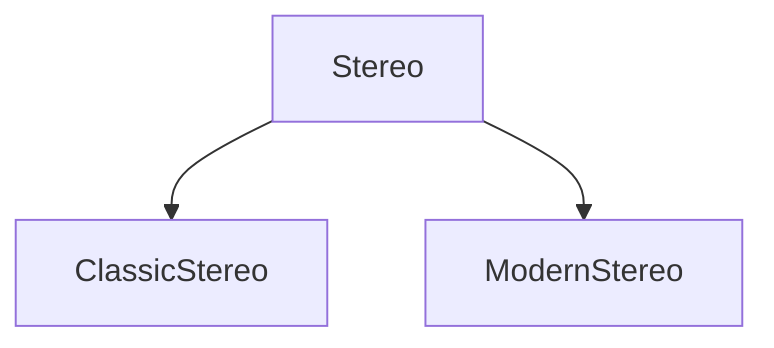

# java-factory-method
Factory Method Pattern



## Java Code
```java
public class StereoFactory {
  public static Stereo getStereo(StereoType type) {
    switch (type) {
      case CLASSIC: return new ClassicStereo();
      case MODERN: return new ModernStereo();
      default: return null;
    }
  }
}
```